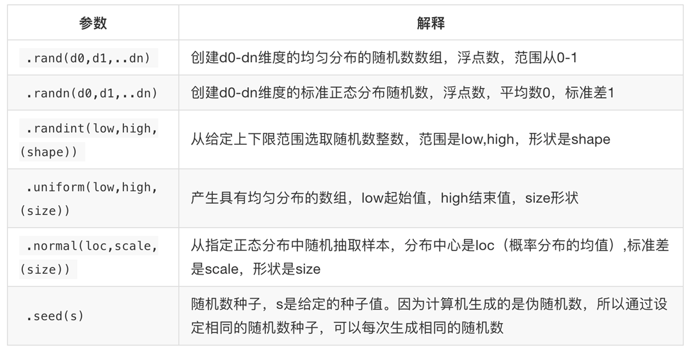
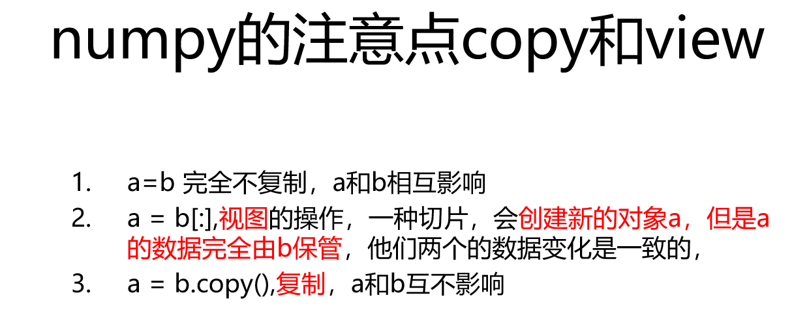
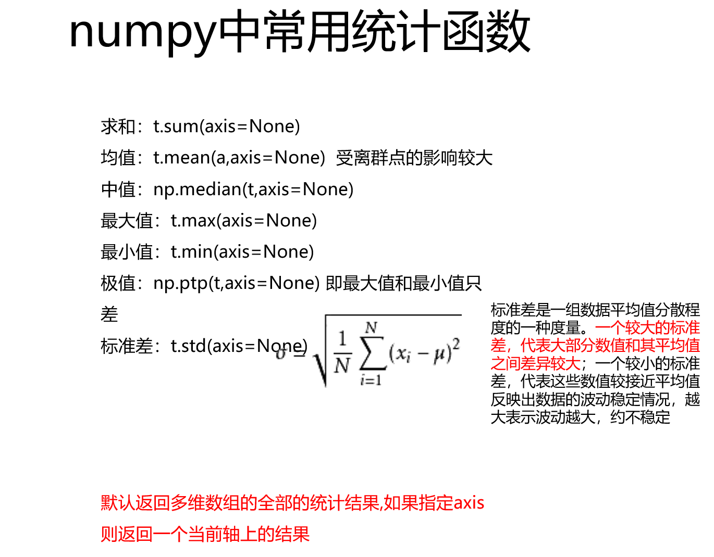

### 广播原则
如果两个数组的后援维度的轴长度相符或其中一方的长度为1，则认为他是广播兼容的
shape为（3，3，2）的数组可以和（3，2）进行计算
shape为（3，3，3）的数组不可以和（3，2）进行计算
### 二维数组的轴axis
对于一维数组axis = 0
二位数组有0轴和1轴
三维数组有0，1，2轴
 ### numpy中的nan和常用方法
### numpy中更多好用的方法
  获取最大值最小值的位置  
  1.```np.argmax(t,axis=0)```  
  2.```np.argmin(t,axis=1)  ```
创建一个全0的数组: ```np.zeros((3,4))```   
创建一个全1的数组:```np.ones((3,4)) ```   
创建一个对角线为1的正方形数组(方阵) ```np.eye(3) ```

### np.random


